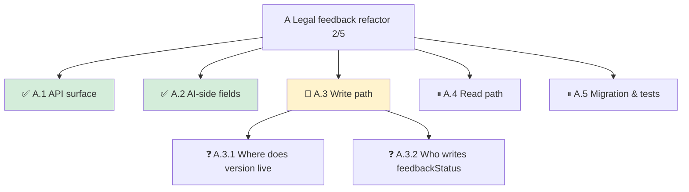

# problem-tree

A Claude Code skill that keeps a live **problem tree** while you brainstorm: which sub-problems are solved, which are blocked, which need *your* decision, and where you are right now. Stored as a Markdown file with a Mermaid diagram, so it renders in Cursor / VS Code / GitHub and survives across sessions.

[中文說明](#中文說明)



## Why

Long brainstorming sessions lose track of themselves. You resolve A.1, wander into A.3.2, get interrupted, come back next week and can't tell what was decided versus proposed. This skill makes Claude maintain one file per topic, `docs/superpowers/handoff/<topic>.md`, with a status line on top:

```
**Progress 2/5 ｜ Now: A.3 Write path ｜ Next: decide A.3.1–A.3.3**
```

## Install

```
/plugin marketplace add JimmyTsai55/problem-tree
/plugin install problem-tree
```

Or just the skill, without the Stop hook:

```
git clone https://github.com/JimmyTsai55/problem-tree ~/.claude/skills/problem-tree-src
ln -s ~/.claude/skills/problem-tree-src/skills/problem-tree ~/.claude/skills/problem-tree
```

Then paste [`docs/CLAUDE.md.snippet`](docs/CLAUDE.md.snippet) into your project (or global) `CLAUDE.md` so Claude checks for unfinished trees at session start. Restart Claude Code.

## Daily use

| Situation | Say |
|---|---|
| A sub-problem comes up | `add sub-problem A.2: <one line>` |
| Start working on one | `go to A.2` |
| Reached a conclusion | `A.2 solved: <conclusion>` |
| Check status | `tree status` |
| Back from another project | `continue` |

After each update Claude replies with one line: `Progress n/m ｜ Now: X ｜ Next: …`

## File format

- **Status line** first: progress, current node, next concrete action.
- **Four node states**, emoji + color so it reads in plain text too:

  | State | Marker | Fill | List |
  |---|---|---|---|
  | Solved | ✅ | `#d4edda` | Solved (one-line conclusion) |
  | In progress | 🔶 | `#fff3cd` | the "Now" in the status line |
  | Needs your decision | ❓ | — | Needs decision (as a question, with proposal) |
  | Blocked | ⏸ | — | Blocked (on what) |

- **Lists in order**: Needs decision → Blocked → Solved. Action items on top, finished work at the bottom.
- **Guardrails**: one 🔶 at a time, depth ≤ 2, ≤ 5 children per node (more → split into roots A, B in the same file, ≤ 3 roots), node text ≤ 15 chars, only conclusions the user actually stated. More than 3 unfinished files in `handoff/` → Claude asks which one to close first.

## Seeing the diagram

Mermaid is plain text; the viewer renders it.
- **Cursor / VS Code**: install *Markdown Preview Mermaid Support*, then `Cmd+Shift+V`. Pin the preview next to the chat — it redraws on every save.
- **GitHub / GitLab / Obsidian**: native.

## Stop hook

The plugin ships a `Stop` prompt hook that, only while brainstorming, checks the tree is current before Claude stops. Note for anyone writing similar hooks: a prompt hook **must explicitly return `ok:true` for the not-applicable case**, otherwise the judge's "condition not met" explanation is read as a block and Claude can't stop.

## When it ends

When the design doc is written, Claude pastes the Mermaid block and the Solved list at the top of the doc and moves the handoff file to `docs/superpowers/handoff/done/`.

## License

MIT

---

# 中文說明

在 brainstorming 過程中維護一棵**問題樹**：哪些子問題解決了、哪些被擋住、哪些等你拍板、現在在哪一顆。存成 Markdown + Mermaid，Cursor / VS Code / GitHub 都能畫圖，跨 session 不會丟。

## 為什麼

長時間的 brainstorming 會忘記自己在哪。A.1 解決了、繞進 A.3.2、被打斷、下週回來分不清哪些是結論、哪些只是提案。這個 skill 讓 Claude 每個 topic 維護一個檔 `docs/superpowers/handoff/<topic>.md`，第一行就是狀態列：

```
**進度 2/5 ｜ 現在做 A.3 寫入路徑 ｜ 下一步：拍板 A.3.1–A.3.3**
```

## 安裝

```
/plugin marketplace add JimmyTsai55/problem-tree
/plugin install problem-tree
```

只裝 skill、不要 Stop hook：

```
git clone https://github.com/JimmyTsai55/problem-tree ~/.claude/skills/problem-tree-src
ln -s ~/.claude/skills/problem-tree-src/skills/problem-tree ~/.claude/skills/problem-tree
```

再把 [`docs/CLAUDE.md.snippet`](docs/CLAUDE.md.snippet) 貼進專案或全域 `CLAUDE.md`，讓 Claude 在 session 開頭檢查有沒有未完成的樹。重開 Claude Code。

## 日常用法

| 情境 | 說 |
|---|---|
| 子問題冒出來 | `加子問題 A.2：〈一句話〉` |
| 決定處理某個 | `進 A.2` |
| 有結論 | `A.2 解決了：〈結論〉` |
| 看狀態 | `樹的狀態` |
| 切專案回來 | `繼續` |

每次更新 Claude 只回一行：`進度 n/m｜現在做 X｜下一步：…`

## 檔案格式

- **狀態列**在第一行：進度、現在位置、下一步要誰做什麼。
- **四種節點狀態**，emoji + 顏色，純文字也讀得出：

  | 狀態 | 標記 | 顏色 | 進哪張清單 |
  |---|---|---|---|
  | 已解決 | ✅ | `#d4edda` | 已解決（結論一行） |
  | 正在處理 | 🔶 | `#fff3cd` | 就是狀態列的「現在做」 |
  | 等你拍板 | ❓ | — | 等你決定（寫成問句，附提案） |
  | 被擋住 | ⏸ | — | 被擋住（等誰） |

- **清單順序**：等你決定 → 被擋住 → 已解決。行動項在上，做完的在下。
- **護欄**：同時只有一個 🔶、深度最多兩層、一個父節點最多五個子節點（超過就拆成 A、B 兩個根放同檔，最多三個根）、節點文字 15 字內、只記使用者說過的結論。`handoff/` 未完成檔超過三個，Claude 會問要不要先結案一個。

## 看圖

Mermaid 是純文字，畫圖是看的工具負責。
- **Cursor / VS Code**：裝 *Markdown Preview Mermaid Support*，`Cmd+Shift+V`。把預覽釘在對話旁邊，每次存檔自動重畫。
- **GitHub / GitLab / Obsidian**：原生支援。

## Stop hook

plugin 附一個 `Stop` prompt hook：只在 brainstorming 時，Claude 停下前確認樹是最新的。踩過的坑：prompt hook **必須明示「不適用時回 ok:true」**，否則判斷模型說「條件不成立」會被當成 block，Claude 停不下來。

## 何時結束

設計文件寫出時，Claude 把 mermaid 區塊和「已解決」清單貼到設計文件最前面，handoff 檔移到 `docs/superpowers/handoff/done/`。
