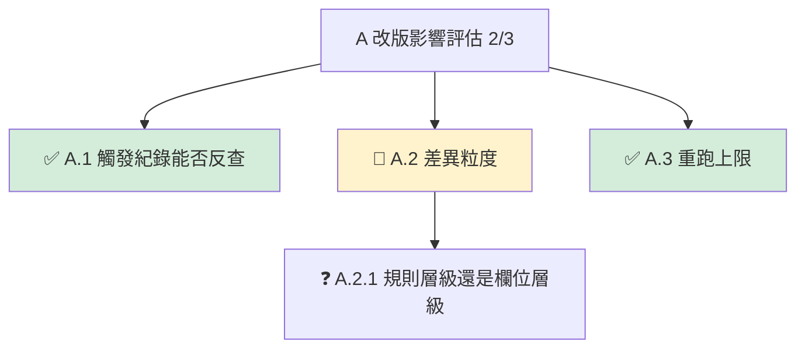

# problem-tree

每個 topic 一個檔：`docs/superpowers/handoff/<topic>.md`。存在就更新，不存在才建立。

## 檔案格式

```markdown
# 改版影響評估

**進度 2/3 ｜ 現在做 A.2 差異粒度 ｜ 下一步：等 PM 拍板粒度層級**



## 等你決定
- A.2.1 暫定規則層級往下做，PM 回覆後改？

## 被擋住
- （無）

## 已解決
- A.1 能反查，抽樣 20 筆有 19 筆對得上
- A.3 先限 500 筆
```

### 狀態列（第一行，最重要）
`**進度 已解決數/子節點數 ｜ 現在做 X 名稱 ｜ 下一步：誰做什麼**`
「下一步」必須是可執行的一句話，不是問題名稱。

### 節點標記（emoji + 顏色，純文字也要讀得出）
| 狀態 | emoji | 顏色 | 進哪張清單 |
|---|---|---|---|
| 已解決 | ✅ | `fill:#d4edda` | 已解決（結論一行） |
| 正在處理 | 🔶 | `fill:#fff3cd` | 就是「現在做」 |
| 等使用者拍板 | ❓ | 不上色 | 等你決定（寫成問句，附提案） |
| 被前置擋住 | ⏸ | 不上色 | 被擋住（寫等誰） |

沒有第五種。

### 清單順序
等你決定 → 被擋住 → 已解決。行動項放最上面，做完的放最下面。

## 規則

- 🔶 永遠只有一個。使用者要同時開第二個，提醒先關一個。
- 深度最多兩層（A → A.1 → A.1.1）。要開第三層，提醒回到父節點。
- 一個父節點下最多五個子節點。超過，提醒把 A 拆成兩個 topic。
- 節點文字 15 字以內，只寫問題本身。理由、數據、選項不進圖，進清單。
- 子問題解決時：節點改 ✅、結論一行寫進「已解決」、目前位置彈回父節點、更新進度數字。
- 所有子節點都 ✅，父節點也改 ✅。
- 只記使用者說過的結論，不自行補完。提案要標「提案」，不當結論。
- 更新後回一行：`進度 n/m｜現在做 X｜下一步：…`，不重述內容。

## 何時結束

brainstorming 寫出設計文件時，把整個 mermaid 區塊和「已解決」清單貼到設計文件最前面，然後把此檔移到 `docs/superpowers/handoff/done/`。

## 新 session 開頭

若使用者說「繼續」或指定此檔，先念一次狀態列（現在做什麼、下一步是什麼），等使用者確認再動。
